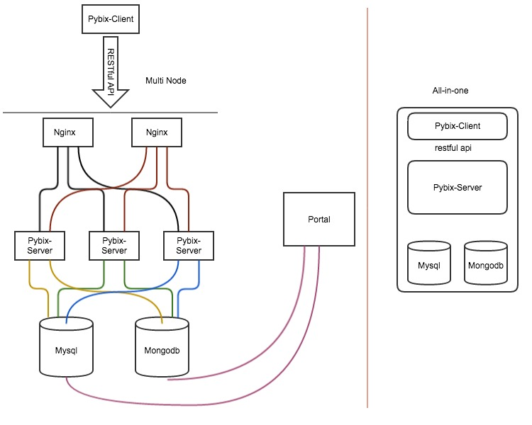

# Pybix Documents

## *Summary*

### Description

`Pybix` is a lightweight monitor framework, using the `Python2.7` language,it contains  `Client` and  `Server` .

1. Use `RESTful` interface between `Client` and `Server` communication.
2. Easy for extending the `Pybix` service.
3. The `Server` is base on `Flask` .
4. Use two database backend include `Mysql` and `Mongodb` , Using `Mysql` for the `host` record and `task` conf, Using `Mongodb` for the `monitor data` .
5. `Pybix` only responsible for monitoring data acquisition and put into database, users can develop `CURD` portal service to display data.

### Topology



### Install and Run test (all-in-one)

```bash
git clone https://github.com/lioncui/pybix
cd pybix
pip install -r requirements.txt
cd server
```

Edit `config.py` , configure the database

```python
DBUSER = 'root'
DBPASS = '123456'
DBHOST = '127.0.0.1'
DBPORT = '3306'
DBNAME = 'pybix'
DEBUG = False
PORT = 8080
SQLALCHEMY_DATABASE_URI = "mysql+pymysql://%s:%s@%s:%s/%s" % (
    DBUSER, DBPASS, DBHOST, DBPORT, DBNAME)
SQLALCHEMY_TRACK_MODIFICATIONS = False

MONGODB_SETTINGS = {'HOST': 'localhost', 'PORT': 27017, 'DB': 'pybix'}
SECRET_KEY = "4RTG2WQSUHEDUJ"
PRE_SHARE_KEY = "7Y5TGH76RFGH6RFGHY5RDCVHY2W34"
```

Run test

```bash
python manage.py runserver
```

> Now already run the pybix-server, If you want to collector monitor data,the following order:
>
> 1. create the host record.
> 2. create the monitor task.
> 3. run the client agent.py.

## *API Reference*

### Services URL

> Your pybix-server provide services ipaddress
>
> demo: http://127.0.0.1:8080

### Examples

1. Hosts

   > GET /hosts
   >
   > GET /hosts/{mac_address}
   >
   > POST /hosts

2. Tasks

   > GET /tasks
   >
   > GET /tasks/{mac_address}
   >
   > POST /tasks

3. Meters

   > GET /meters/{task_uuid}
   >
   > POST /meters/{task_uuid}

> You can refer to `json.example`  file in the `pybix/server/examples`  directory.
>
> HTTP Requset Header must specify `Content-Type: application/json` 

## *Develop Plugin*

All plug-ins was inherited the parent class `p_class.plugins.plugin` ,only to refactoring `getData` function , after than created a specify `pluginFileName` and `pluginClassName` for task.

The `CustomPlugin.py` demo code:

```python
from lib import pybixlib
import traceback
from p_class import plugins


class CustomPlugin(plugins.plugin):

    def __init__(self, uuid, taskConf, agentType):
        plugins.plugin.__init__(
            self, uuid, taskConf, agentType)

    def getData(self):
        try:
            redata = {"foo": "bar"}
        except Exception:
            pybixlib.error(self.logHead + traceback.format_exc())
            self.errorInfoDone(traceback.format_exc())
            redata = {}
        finally:
            self.setData({'agentType': self.agentType, 'uuid': self.uuid,
                          'code': self.code, 'time': self.getCurTime(),
                          'data': redata, 'error_info': self.error_info})
            self.intStatus()

```

## License


`Pybix` is licensed under GPL v3. The license is availabe [here](https://github.com/lioncui/pybix/blob/master/LICENSE).
